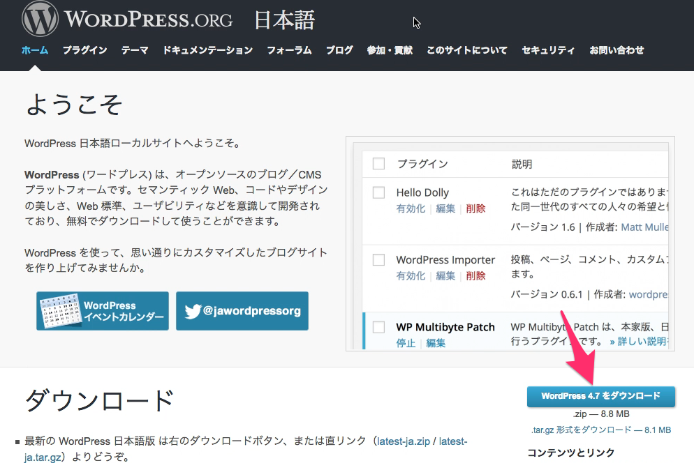
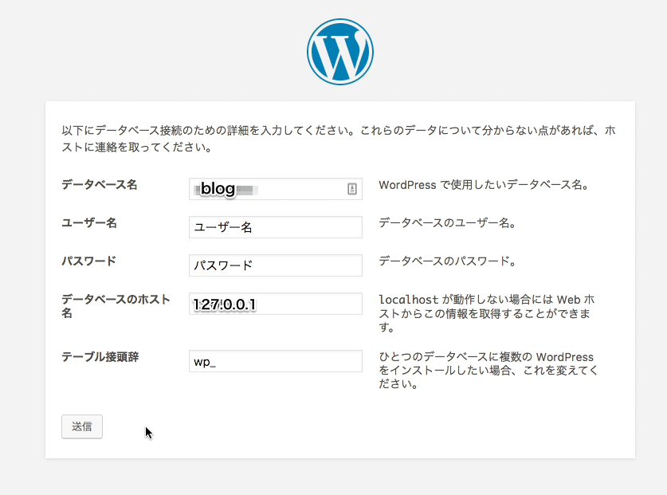
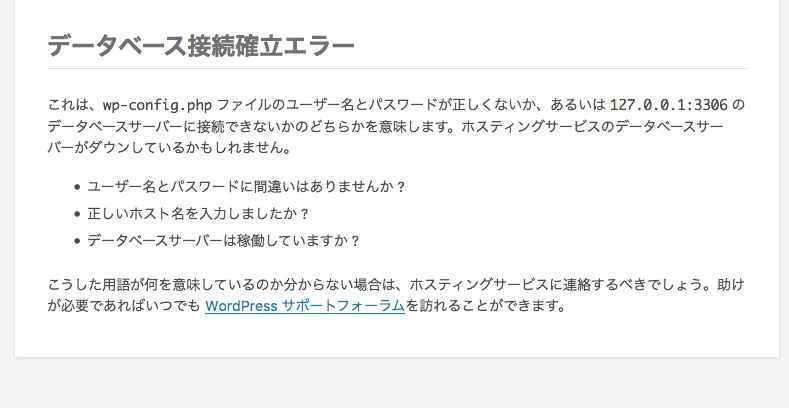
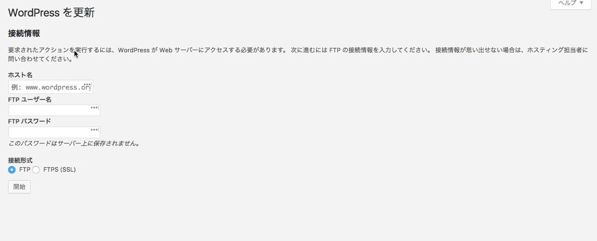
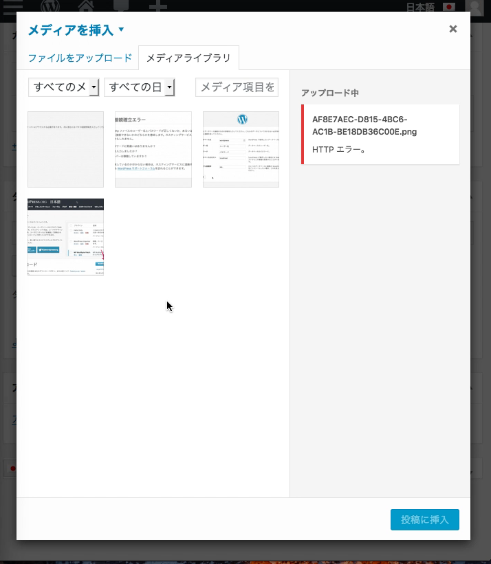

MacでAMP環境を構築するにはMAMPを使う方法もあるけど、アプリは増やしたくない。  
そこで今回はMAMPを使わずにローカルにAMP環境を構築してみた。

## 前提条件

- OSがSierraであること
- Homebrewがインストールされていること

## Apacheの設定

Apacheは標準でインストールされている。  
PHPを有効化するためには`/etc/apache2/httpd.conf`の中身を書き換える。

```diff
- # LoadModule php5_module libexec/apache2/libphp5.so
+ LoadModule php5_module libexec/apache2/libphp5.so
---
- # AllowOverride All
+ AllowOverride All
```

設定を変更したら再起動。

```bash
$ sudo apachectl start
```

## MySQLの設定

インストールして、権限を変更。

```bash
$ brew install mysql
$ sudo chown -R _mysql /usr/local/var/mysql
$ sudo chmod -R g+rwx /usr/local/var/mysql
```

次にMySQLのrootユーザーのパスワードを変更。

```bash
$ mysqladmin -u root password ‘任意のパスワード'
```

ログインしてWordPress用のデータベースを作成。  
ここではデータベース名をblogとしている。

```bash
$ mysql -u root -p
Enter password: 設定したパスワード
$ mysql > create database blog;
```

MySQLのソケットのパスを確認。

```bash
$ mysql > status
...
UNIX socket: /tmp/mysql.sock
```

ログアウト。

```bash
$ mysql > exit
```

これで設定は整ったので、MySQLサーバーを起動。

```bash
$ mysql.server start
```

Macを再起動すると、mysqlサーバーも停止する。  
WordPressを開く前にこのコマンドを打つ必要がある。  
ただし、OSXのlaunchdという機能を使えば自動起動できる。

## PHPの設定

Sierraでは標準でインストールされている。
設定ファイルをコピーして編集。

```bash
$ sudo cp /etc/php.ini.default /etc/php.ini
```

`/etc/php.ini`を編集して先程のMySQLのソケットのパスを入れる。

```diff
- mysql.default_socket=
+ mysql.default_socket = /tmp/mysql.sock
```

## phpMyAdminの設置

データベースの操作にphpMyAdminを使いたいので、インストール。  
[こちら](https://www.phpmyadmin.net/downloads/)からダウンロードできる。  
解凍すると、phpMyAdminというフォルダができるので、それをWEBサーバーのドキュメントルートに設置。  
ドキュメントルートのパスは特に変更していなければ、`/Library/WebServer/Documents`。

デフォルト設定ファイルをコピーして編集。

```bash
$ cd /Library/WebServer/Documents/phpMyAdmin
$ sudo cp config.sample.inc.php config.inc.php
```

`config.inc.php`を下記のように書き換える。

```diff
- $ cfg['Servers'][$i]['host'] = ‘localhost’;
+ $ cfg['Servers'][$i]['host'] = ’127.0.0.1′;
```

## WordPressの設置

これで[WordPress](https://ja.wordpress.org/)を設置する準備が整った。



ダウンロードして解凍したらwordpressというフォルダができるので、それをWebサーバーのドキュメントルートへ移動させる。

権限を変更しておく。

```bash
$ sudo chown -R _www:_www wordpress
```

あとは`http://rikson.net/`にアクセスして画面に沿って設定するだけ。



データベース名・ユーザー名・パスワードはMySQLで設定したもの。  
データベースのホスト名は`127.0.0.1`として、うまくいかない場合は```localhost```にしてみるとよい。

## 遭遇したエラー

### データベース接続確立エラー

ブログにアクセスすると「データベース接続確立エラー」という真っ白のページが表示された。

エラーの内容を表示するためにwp-config.phpを書き換えてみる。

```diff
- define('WP_DEBUG', false);
+ define('WP_DEBUG', true);
```

もう一度アクセスすると以下のように表示された。



ホスト名を`localhost`から`127.0.0.1`に変更したらうまくいった。

### アップデートやプラグインをインストールできない

なぜかFTPサーバーの情報を聞かれる。



所有者を変更することでイケた。

```bash
$ sudo chown -R _www:_www wordpress
```

この `_www:_www` は、httpd.confの中のUSER、GROUPの値。

### 画像アップロードエラー

ドラッグ&ドロップで画像をアップロードしたらHTTPエラーが発生した。



書き込み権限が原因になることが多いようだけど、今回はPHPの設定が原因だった。  
デフォルトの設定ファイルではファイルのアップロード容量の制限が低すぎるので変更。  
`/etc/php.ini`の中の```upload_max_filesize```という項目を探して、最大容量を256MBに変更。

```diff
- upload_max_filesize = 2M
+ upload_max_filesize = 256M 
```

## 参考

- [【Yosemite】Mac OSX 10.10 Yosemite にAMP環境の構築【初心者必見】【続編】 - Qiita](http://qiita.com/keneo/items/7e5851a066e0b276f4a9)
- [MacでWordPressをローカルインストールする(MAMPなし, phpmyadminなし) - Qiita](http://qiita.com/himitech/items/342235828a4c2513dd4d)
- [Wordpress入れたら「データベース接続確立エラー」が消えない - Qiita](http://qiita.com/ritukiii/items/1510a1bd1ee90841f15a)
- [WordPressのインストール方法\| 設定・使い方 \| [Smart]](http://rfs.jp/sb/wordpress/wp-howto/wp01_install.html)
- [WordPress更新時にFTP情報入力画面が表示される場合の対処方法3つ \| sand a lot Web &amp; Music Create [札幌]](http://www.sandalot.com/wordpress%E6%9B%B4%E6%96%B0%E3%81%A7ftp%E5%85%A5%E5%8A%9B%E7%94%BB%E9%9D%A2%E3%81%8C%E8%A1%A8%E7%A4%BA%E3%81%95%E3%82%8C%E3%82%8B%E5%A0%B4%E5%90%88%E3%81%AE%E5%AF%BE%E5%87%A6%E6%B3%95/)
- [mac MySQL ターミナル 自動起動 - Qiita](http://qiita.com/rinkun/items/c1649bcbe9a79bf2b07e)
- [WordPressの画像アップロード時に”HTTPエラー”と表示されます｜レンタルサーバーならクイッカ](http://www.quicca.com/support/faq/75)

