サービス開発をしていると、カスタマイズ性を高めすぎて、逆に使いづらくなることがあります。  
この問題の本質について考えてみました。

## サービスデザインでぶつかる壁

あるブログCMSの記事編集画面ではHTMLを記述しなくてもドラッグ&ドロップでパーツを組み合わせて記事を作成できます。

ユーザーからテーマを選択できるようにしてほしいという要望が出たため、テーマを選択できるようにしました。

すると、ユーザーから部分的なデザインのカスタマイズができるようにしてほしいという要望が出たため、部分的なカスタマイズできるようにしました。

ところが、ユーザーはHTMLの属性もカスタマイズしたいと言い出しました。  
と、この調子でユーザーの自由度を高めていくと、HTMLを記述するのと変わらなくなり、サービスモデル自体が変容していきます。

## 三面等価の原則

先ほどの問題をもう少し抽象的に整理すると下記のようになります。

- **権限**: リソースを扱う権利の範囲
- **責務**: 目的を果たすために必要な作業
- **責任**: 生じた事象に対処する義務

権限の大きさに応じて、責務と責任も増えます。  
マネジメントの分野ではこのことを三面等価の原則と呼びます。  
サービスデザインでは、この三面等価の原則を意識して何をどこまで提供するのか見定める必要があります。  
ターゲット・ユーザーが引き受けられないような大きすぎる権限を与えてはいけません。

## サービスが打ち出す価値観

サービスとはユーザーの要求を満たす価値を提供するものです。  
利用状況網羅性を高めることは様々なニーズを満たすために重要ですが、どこかで歯止めをかけてユーザーと価値観を共有できなければサービス自体が成立しません。  
その価値観を打ち出すことこそサービスデザインの根幹だと思います。
